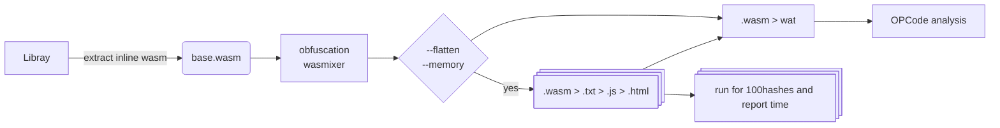

This folder is used to test and analyze the capabilities of [WASMixer](github.com/security-pride/WASMixer).

This `scripts/` folder contains helpers to generate, process and analyze WebAssembly (WASM) variants produced by WASMixer. 

The workflows here are used to:

- apply obfuscation combinations to a base WASM binary
- convert generated WASM into text/decimal formats
- inject generated payloads into JavaScript/HTML templates for local testing
- run simple performance experiments (e.g., repeated hash runs) and collect opcode distributions


**Scripts (what they do)**
- `wasm_mixer_combinations.py` — enumerates obfuscation flags/combinations and runs WASMixer on `base.wasm`. Produces output under `composed/wasm/`.
- `composed/wasm_process.sh` — helper shell script to convert `.wasm` -> `.wat` and `.wasm` -> decimal `.txt` using `wasm2wat` and `binex.py`.
- `inject_decimal_into_javascript.py` — creates JS files by inserting decimal arrays into a `base_placeholder.js` template.
- `inject_js_into_html.py` — (if present) copies generated JS into HTML templates for local testing in a browser.
- `playground_for_hundred_hashes.py` — runs an experiment that repeatedly executes the in-browser hashing routine and logs timings.
- `opcode_distribution.py` — parses generated `.wat` files and computes opcode frequency distributions, writing results under `composed/opcodes/`.

**Repository layout (relevant paths)**
- `../../binex/binex.py` — conversion helper used by `wasm_to_txt.sh`
- `composed/` — where generated artifacts live: `wasm/`, `wat/`, `txt/`, `js/`, `opcodes/`.

Usage examples
---
Generate all combinations and produce artifacts:
```bash
pyenv local 3.10
python wasm_mixer_combinations.py --input placeholder/base.wasm --cli <your_path_to_wasmixer_cli_folder> --args flatten,memory,alias,name,collatz --outdir ../mixed

bash wasm_process.sh

# optional
python inject_decimal_into_javascript.py
python inject_js_into_html.py   

# experimental(wip)
python playground_for_hundred_hashes.py --html-folder ../mixed/html --server-script ../../../cryptomock_server/server.py```

Compute opcode distributions:
```bash
python opcode_distribution.py mixed/wat mixed/opcodes
python graph_create.py ../mixed/opcodes/detailed_opcode_analysis.csv ../mixed/charts --all-opcodes --skip-equal --best --max-opcodes 15 # --per-row

```


References
---
- WASMixer: https://github.com/security-pride/WASMixer
- WABT (wasm2wat): https://github.com/WebAssembly/wabt
- binex utility in this repo: `crypto_javascript/tools/binex/binex.py`

Operational Flow
---

